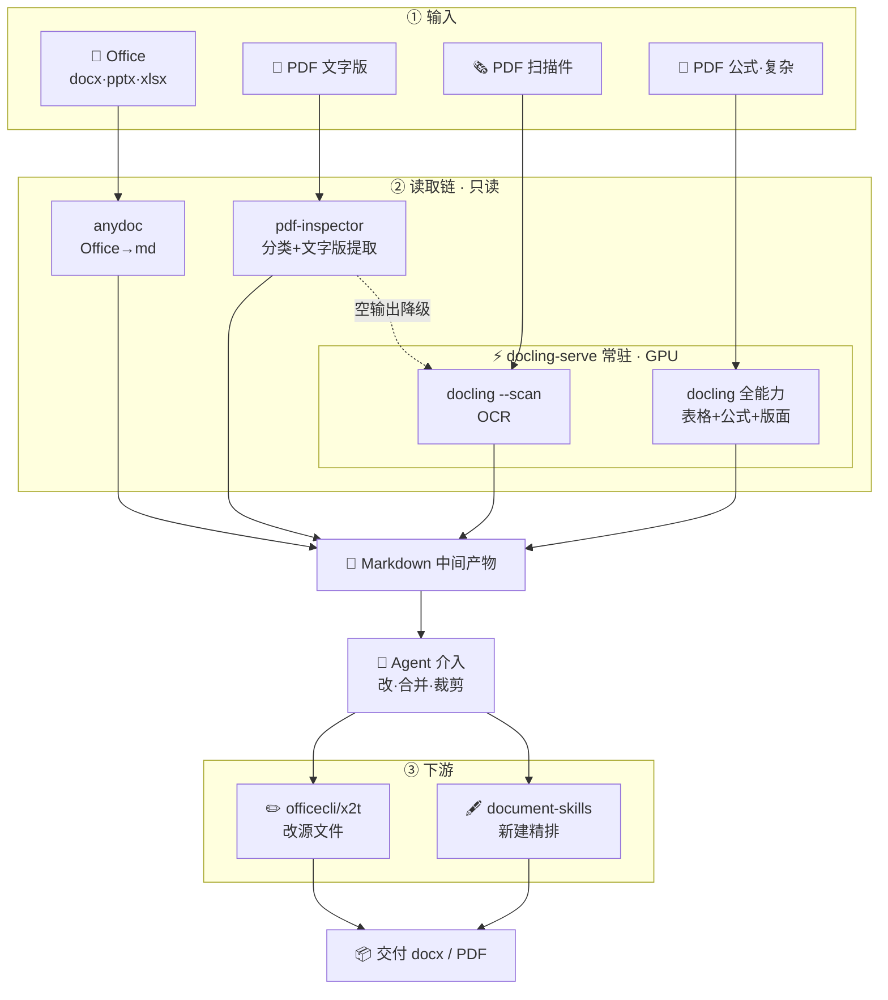

# Office Workflow — 文档→Markdown 生产化实践（Windows + NVIDIA GPU）

> 让 AI 读完本文就能在你的电脑上装起来。全部依赖开源，本仓库是"路由思想 + 五个坑解法"的参考实现。

一句话定位：**把 docx/pptx/xlsx/PDF（文字/扫描/公式）用各自最优的开源引擎转成 Markdown，供 LLM 读取**——分类驱动 + 链式降级 + GPU 常驻，实测批量混合文档 4 秒。

---

## 为什么值得看（别人抄不到的部分）

1. **分层路由**：不是单引擎一刀切，而是"每类文档用最优引擎 + 分类失败/提取失败逐级降级"——生产级范式
2. **Windows 中文路径坑**：FastAPI/starlette 在 Windows 按 GBK 解码 UTF-8 百分号编码，中文路径必乱码——**base64 传输彻底绕开**（社区少见系统性解法）
3. **GPU 启动费摊薄**：docling 每进程 ~135s 启动费（模型加载+GPU 图编译），常驻 serve 只付一次 → 批量秒级
4. **无 cl.exe 也能跑 torch**：`TORCHDYNAMO_SUPPRESS_ERRORS=1` 让 inductor 编译失败静默回退 eager
5. **降级链完整**：pdf-inspector 挂了 → pymupdf 兜底分类；空输出 → 自动换引擎

---

## 架构



**路由思想（灵魂）**：每类文档走最优引擎，任何一个环节失败都有下一档兜底，绝不让一个引擎的故障拖垮整批。

---

## 快速开始（AI 照做）

```bash
# 1. 克隆
git clone <repo-url> && cd office-workflow

# 2. 安装（选一个）
bash install.sh                                      # CPU 模式（能用，扫描件慢）
DOCLING_GPU=1 bash install.sh                        # NVIDIA GPU（torch cu126 ~2.4GB，走阿里云镜像）
DOCLING_LOCAL_WHEELS=/path/to/wheels bash install.sh # 离线/复用本地 cu126 wheel
PIP_INDEX=https://pypi.tuna.tsinghua.edu.cn/simple bash install.sh  # 国内加速（可叠加）
# 预期输出末尾：
#   ═══ 安装完成 ═══
#   下一步（AI 照做即可）：...

# 3. 加载本机配置 + 启动常驻服务（首次预热 4-5 分钟）
source config.env
bash src/docling-serve.sh start
# 等日志出现 "预热完成,服务就绪"（tail -f serve.log）

# 4. 验证
bash src/docling.sh md sample/scan.pdf      # 扫描件 OCR → 应输出 "扫描件示例 数据: 电阻 100Ω..."
python src/convert_docs.py sample/ -o sample/md_out   # 批量路由 → 成功 2 失败 0
```

**故障排查**：
| 现象 | 处理 |
|---|---|
| torch 下载慢/中断 | 用 `DOCLING_LOCAL_WHEELS` 或手动 aria2 下载后指向目录 |
| `InvalidCxxCompiler: cl is not found` | 正常，shim 已设 `TORCHDYNAMO_SUPPRESS_ERRORS=1` 自动回退 |
| serve 起了但转换走回退（慢） | 检查 `serve.log`；中文路径 500 → 确认用的是本仓库 shim（含 base64 修复） |
| 批量扫描件慢 | 没起 serve——先 `docling-serve.sh start` 预热 |

---

## 使用

```bash
# 单份 → stdout
bash src/docling.sh md 论文.pdf
bash src/docling.sh md --scan 扫描件.pdf          # 纯扫描件走轻量模式
# 批量目录 → md_out/
python src/convert_docs.py "我的文档/" -r -o out/
```

## 目录结构

```
office-workflow/
├── install.sh           # 一键重建环境（检测→venv→依赖→config→sample）
├── requirements.txt     # 钉版依赖（torch 由 install 分支管）
├── config.env          # 本机路径（install 生成，source 后生效）
├── src/
│   ├── convert_docs.py     # ★ 分层路由：分类驱动 + 降级链 + pymupdf 兜底 + 短输出警告
│   ├── docling_server.py   # GPU 常驻 + 双模型预热 + base64 中文路径
│   ├── docling.sh          # serve 优先 + 自动回退单进程
│   └── docling-serve.sh    # 启停脚本
├── sample/              # install 生成的验证件（report.pdf 文字版 / scan.pdf 扫描件）
└── docs/                # 坑解法详解
```

## 五个坑解法（详见 docs/）

| # | 坑 | 解法 |
|---|---|---|
| 1 | Windows 中文路径 500 | base64 传输（`docs/坑01-中文路径base64.md`） |
| 2 | GPU 启动费 135s/进程 | 常驻 serve + 双模型预热（`docs/坑02-GPU启动费摊薄.md`） |
| 3 | 单引擎一刀切脆弱 | 分层路由 + 降级链（`docs/坑03-分层路由与降级链.md`） |
| 4 | 无 cl.exe torch 报错 | `TORCHDYNAMO_SUPPRESS_ERRORS=1` |
| 5 | 分类器单点故障 | pymupdf 阈值兜底 |

## 已知限制（诚实声明）

- **公式→LaTeX 中等**：内联公式可出，块级/复杂公式弱于 MinerU（需另装 Py3.12 + 20GB）
- **扫描件慢**（CPU 模式）：无 GPU 时每份 ~90s+；GPU + serve 后 ~1s/页
- **编辑链定案不建**：读取产物是 md，"md 变更→回写源文件"无自动 diff 桥（改源请用 officecli 类工具手工），防降维副本覆盖源文件
- **依赖第三方二进制**：anydoc/pdf-inspector 需额外安装（见 requirements 注释），未装时对应格式进失败清单，PDF 链不受影响

## 许可证

本仓库 MIT。依赖均为开源：docling(IBM, MIT)、pdf-inspector(Firecrawl, MIT)、anydoc(Firecrawl)、pymupdf、reportlab、fastapi/uvicorn。
