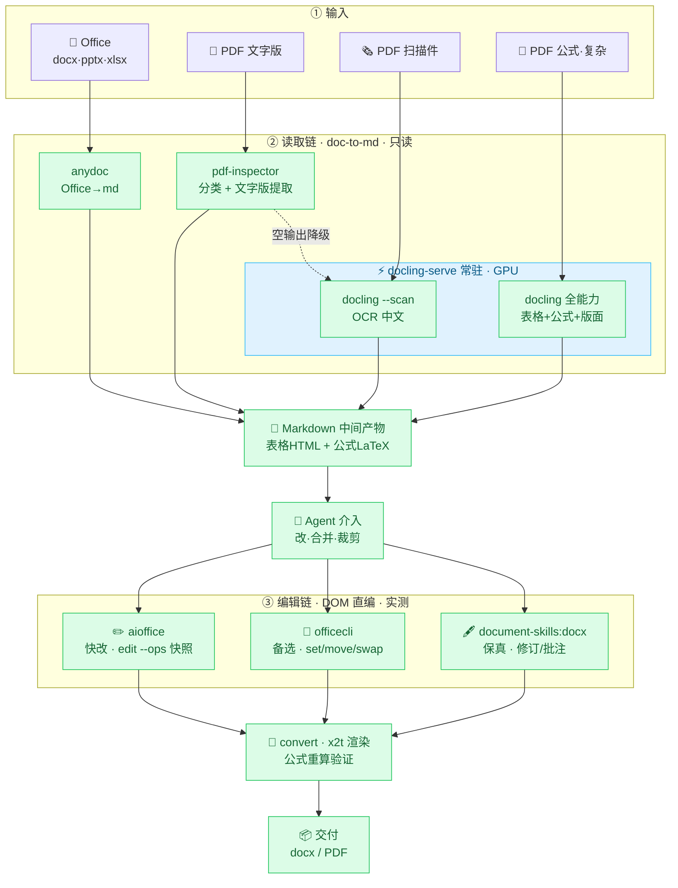

# Office Workflow — 文档→Markdown 生产化实践（Windows + NVIDIA GPU）

> 让 AI 读完本文就能在你的电脑上装起来。全部依赖开源，本仓库是"路由思想 + 五个坑解法（+坑04编辑链）"的参考实现。

一句话定位：**把 docx/pptx/xlsx/PDF（文字/扫描/公式）用各自最优的开源引擎转成 Markdown，供 LLM 读取**——分类驱动 + 链式降级 + 可选 GPU 常驻。

**默认轻量**：基础安装只有 CPU torch（~200MB）+ 开源库，Office 转换/文字 PDF/扫描件 OCR 全覆盖，无 GPU 也能用。**2.4GB GPU 模型是可选增强**（理工科/公式/批量扫描件才需要），不装不影响日常。实测批量混合文档 4 秒（GPU 档）。

---

## 为什么值得看（别人抄不到的部分）

1. **分层路由**：不是单引擎一刀切，而是"每类文档用最优引擎 + 分类失败/提取失败逐级降级"——生产级范式
2. **Windows 中文路径坑**：FastAPI/starlette 在 Windows 按 GBK 解码 UTF-8 百分号编码，中文路径必乱码——**base64 传输彻底绕开**（社区少见系统性解法）
3. **GPU 启动费摊薄**：docling 每进程 ~135s 启动费（模型加载+GPU 图编译），常驻 serve 只付一次 → 批量秒级
4. **无 cl.exe 也能跑 torch**：`TORCHDYNAMO_SUPPRESS_ERRORS=1` 让 inductor 编译失败静默回退 eager
5. **降级链完整**：pdf-inspector 挂了 → pymupdf 兜底分类；空输出 → 自动换引擎

---

## 架构



**路由思想（灵魂）**：每类文档走最优引擎，任何一个环节失败都有下一档兜底，绝不让一个引擎的故障拖垮整批。**编辑链直接 DOM 编辑源文件**（非 md 回写），快改/保真/转换三层分工。

---

## 快速开始（AI 照做）

> **两档模式，按需选一**：
> - **轻量版（默认，推荐大多数）**：`bash install.sh` 即可，PyPI 装 CPU torch（~200MB），覆盖 Office 转换 + 文字 PDF + 扫描件 OCR。**不装 2.4GB GPU 模型**——非理工科、不处理公式/批量扫描件的完全够用。
> - **完整版（理工科/公式/批量扫描件）**：`DOCLING_GPU=1`，额外下载 torch cu126（~2.4GB）+ NVIDIA GPU，公式/复杂版面/批量转换秒级。

```bash
# 1. 克隆
git clone <repo-url> && cd office-workflow

# 2. 安装（二选一，都是全开源）
bash install.sh                                      # 轻量版：CPU torch ~200MB，默认即可
DOCLING_GPU=1 bash install.sh                        # 完整版：+GPU cu126 torch ~2.4GB（理工科/公式场景）
# 其他可叠加选项：
#   DOCLING_LOCAL_WHEELS=/path/to/wheels  # 离线/复用本地 cu126 wheel（完整版加速）
#   PIP_INDEX=https://pypi.tuna.tsinghua.edu.cn/simple  # 国内加速
# 预期输出末尾：
#   ═══ 安装完成 ═══
#   下一步（AI 照做即可）：...

# 3. 加载本机配置 + 启动常驻服务（首次预热 4-5 分钟）
source config.env
bash src/docling-serve.sh start
# 等日志出现 "预热完成,服务就绪"（tail -f serve.log）

# 4. 验证
bash src/docling.sh md sample/scan.pdf      # 扫描件 OCR → 应输出 "扫描件示例 数据: 电阻 100Ω..."
python src/convert_docs.py sample/ -o sample/md_out   # 批量路由 → 成功 2 失败 0
```

**故障排查**：
| 现象 | 处理 |
|---|---|
| torch 下载慢/中断 | 用 `DOCLING_LOCAL_WHEELS` 或手动 aria2 下载后指向目录 |
| `InvalidCxxCompiler: cl is not found` | 正常，shim 已设 `TORCHDYNAMO_SUPPRESS_ERRORS=1` 自动回退 |
| serve 起了但转换走回退（慢） | 检查 `serve.log`；中文路径 500 → 确认用的是本仓库 shim（含 base64 修复） |
| 批量扫描件慢 | 没起 serve——先 `docling-serve.sh start` 预热 |

---

## 使用

```bash
# 单份 → stdout
bash src/docling.sh md 论文.pdf
bash src/docling.sh md --scan 扫描件.pdf          # 纯扫描件走轻量模式
# 批量目录 → md_out/
python src/convert_docs.py "我的文档/" -r -o out/
```

## 编辑链（2026-08-14 实测成型）

读取链产出 md 后，**编辑源文件走独立 DOM 工具链**（全开源，已实测）：

```
快改（挪表格/改数据/新建）→ aioffice edit --ops（JSON 信封+自动快照+乐观并发）
保真（修订跟踪/批注/精确格式）→ document-skills:docx（官方插件）+ 方法论
公式重算验证 → x2t 转 PDF → 读 PDF 文本核对结果（aioffice 不重算，实测）
交付 → aioffice convert / x2t
```

**实测能力**：
```bash
# 改 Excel 单元格（批量原子，自动快照）
aioffice edit data.xlsx --ops '[{"op":"set","path":"/'\''实验数据'\''/B2","props":{"value":27.5}}]'
# docx 加段落/改文字
aioffice edit report.docx --ops '[{"op":"add","path":"/body","type":"p","props":{"text":"第一节 实验目的"}}]'
# 跨文档挪表格（xlsx 无原生 move → csv 中转）
aioffice read 源.xlsx --view csv → aioffice create 目标.xlsx --from 数据.csv
# 公式结果验证（x2t 渲染时真算）
x2t formula.xlsx formula.pdf && 读 PDF 文本看 SUM 结果
```

**编辑链坑（实测）**：xlsx `move`/`add cell` 不支持（结构级 add 可：sheet/table/chart/…）；docx add 段落类型是 `p` 不是 `paragraph`；中文 sheet 名路径要引号 `/'实验数据'/B2`；`--ops` 内引号用 `\u0027` 转义。

## 目录结构

```
office-workflow/
├── install.sh           # 一键重建环境（检测→venv→依赖→config→sample）
├── requirements.txt     # 钉版依赖（torch 由 install 分支管）
├── config.env          # 本机路径（install 生成，source 后生效）
├── src/
│   ├── convert_docs.py     # ★ 分层路由：分类驱动 + 降级链 + pymupdf 兜底 + 短输出警告
│   ├── docling_server.py   # GPU 常驻 + 双模型预热 + base64 中文路径
│   ├── docling.sh          # serve 优先 + 自动回退单进程
│   └── docling-serve.sh    # 启停脚本
├── sample/              # install 生成的验证件（report.pdf 文字版 / scan.pdf 扫描件）
└── docs/                # 坑解法详解
```

## 六个坑解法（详见 docs/）

| # | 坑 | 解法 |
|---|---|---|
| 1 | Windows 中文路径 500 | base64 传输（`docs/坑01-中文路径base64.md`） |
| 2 | GPU 启动费 135s/进程 | 常驻 serve + 双模型预热（`docs/坑02-GPU启动费摊薄.md`） |
| 3 | 单引擎一刀切脆弱 | 分层路由 + 降级链（`docs/坑03-分层路由与降级链.md`） |
| 4 | 无 cl.exe torch 报错 | `TORCHDYNAMO_SUPPRESS_ERRORS=1` |
| 5 | 分类器单点故障 | pymupdf 阈值兜底 |
| 6 | 编辑链边界不清 | aioffice 实测边界 + csv 中转 + x2t 算公式（`docs/坑04-编辑链.md`） |

## 已知限制（诚实声明）

- **两档能力边界**：轻量版（默认）覆盖 Office 转换 + 文字 PDF + 扫描件 OCR，公式→LaTeX 与批量扫描件偏慢；完整版（`DOCLING_GPU=1`，+2.4GB）才上 GPU 秒级与复杂版面。日常办公文档两档体验一致。

- **公式→LaTeX 中等**：内联公式可出，块级/复杂公式弱于 MinerU（需另装 Py3.12 + 20GB）
- **扫描件慢**（CPU 模式）：无 GPU 时每份 ~90s+；GPU + serve 后 ~1s/页
- **编辑链（2026-08-14 实测成型，非断点）**：读取产物是 md，**编辑走独立 DOM 工具链**（aioffice 快改 / officecli 备选 / x2t 交付，详见下节）——不是"md 回写源文件"（防降维覆盖），是"直接编辑源文件"。**实测边界**：xlsx 单元格级 move/add 不支持（挪表走 read csv→create --from csv 中转）；docx set/add 全通；公式重算 aioffice 不算但 x2t 渲染时算（转 PDF 验证结果）
- **依赖第三方二进制**：anydoc/pdf-inspector 需额外安装（见 requirements 注释），未装时对应格式进失败清单，PDF 链不受影响

## 许可证

本仓库 MIT。依赖均为开源：docling(IBM, MIT)、pdf-inspector(Firecrawl, MIT)、anydoc(Firecrawl)、pymupdf、reportlab、fastapi/uvicorn。
