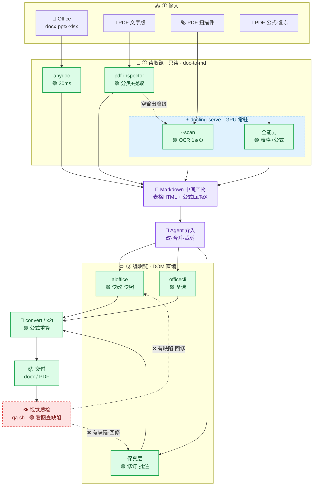

# Office Workflow — AI 文档代工流水线（Windows + NVIDIA GPU）

> **给 AI 的一句话安装入口**：把这行发给你的 Agent ——
> `请按 https://github.com/TunaTung/office-workflow 的 README 帮我安装这套文档代工流水线（我是非理工科/理工科，需要/不需要编辑和公式）`
> Agent 会读完下文自行安装：读取链自动装，编辑链/重型工具按你的场景提示手动装。

全部依赖开源，本仓库是"AI 代工文档"的完整参考实现——**从读取到质检，AI 全程自主，Markdown 只是中间产物**。

一句话定位：**让 AI 看懂（读取链）→ 改得动（编辑链）→ 交得出（交付链）→ 验得了（视觉质检）docx/pptx/xlsx/PDF**，每个环节用最优开源引擎，分类驱动 + 链式降级 + GPU 常驻。

**为什么不是"文档→Markdown"**：转 md 只是第一段——它让你看懂文档；真正牛的是**后半段**：aioffice 直接编辑源文件（DOM+快照+乐观并发）、x2t/convert 交付 PDF、**视觉质检环**（渲染成图 → 视觉模型看图查排版缺陷 → 修复重渲染），这才是"AI 代工"而非"AI 阅读"。

**默认轻量**：基础安装只有 CPU torch（~200MB）+ 开源库，读取全覆盖；**2.4GB GPU 模型是可选增强**（公式/批量扫描件秒级）。实测批量混合文档 4 秒（GPU 档）。

---

## 为什么值得看（别人抄不到的部分）

1. **分层路由**：不是单引擎一刀切，而是"每类文档用最优引擎 + 分类失败/提取失败逐级降级"——生产级范式
2. **Windows 中文路径坑**：FastAPI/starlette 在 Windows 按 GBK 解码 UTF-8 百分号编码，中文路径必乱码——**base64 传输彻底绕开**（社区少见系统性解法）
3. **GPU 启动费摊薄**：docling 每进程 ~135s 启动费（模型加载+GPU 图编译），常驻 serve 只付一次 → 批量秒级
4. **无 cl.exe 也能跑 torch**：`TORCHDYNAMO_SUPPRESS_ERRORS=1` 让 inductor 编译失败静默回退 eager
5. **降级链完整**：pdf-inspector 挂了 → pymupdf 兜底分类；空输出 → 自动换引擎

---

## 架构



**闭环思想（灵魂）**：素材（Office/PDF 各型）→ 读取工具（anydoc/pdf-inspector/docling）→ Markdown 产出 → Agent 介入 → 编辑工具（aioffice/officecli/document-skills）→ 交付产出（docx/PDF）→ 视觉质检（qa.sh）→ 有缺陷回编辑工具修复重渲染。AI 全流程自主，Markdown 只是看懂环节的中间产物。

---

## 按需安装（先看你要做什么，再决定装多重）

| 你的需求 | 需要装什么 | 总量 | 装法 |
|---|---|---|---|
| **只读文档**（转 md / 提取 / 喂 LLM） | 读取链全件 | ~1GB | `bash install.sh` 自动装，**5 分钟搞定** |
| **+ 改文档**（改数据/挪表/新建报告） | 上一行 + 编辑链工具 | +~50MB | 手动装：aioffice + pdf-inspector（officecli 可选） |
| **+ 交付 PDF / 公式重算** | 上一行 + ONLYOFFICE x2t | +~几百 MB | 手动装 ONLYOFFICE（桌面版/转换器） |
| **+ 视觉质检**（AI 自检排版） | 只需一个视觉 API key | 0 下载 | 仓库内置 `qa.sh`，设 `ARK_API_KEY` 即可 |
| **+ GPU 秒级**（公式/批量扫描件） | `DOCLING_GPU=1` 装 cu126 | +2.4GB | install.sh GPU 分支（理工科才需要） |
| **+ PDF 重活**（OCR/水印/签名） | Stirling-PDF | ~几百 MB | 可选，按需启停 |

**核心判断**：
- **非理工科 / 只读不改** → 只跑 `install.sh`，之后什么都不要装
- **理工科 / 要改要交付** → + 编辑链 + ONLYOFFICE（这是"重型工具"的主要场景）
- **要 AI 质检** → 永远只加一个 key，零下载

**分档明细**：

**install.sh 自动装（读取链）**：

| 项 | 大小 | 来源 |
|---|---|---|
| 仓库代码 | ~1MB | `git clone <repo-url>` |
| Python 3.10-3.14 | ~100MB | [python.org](https://www.python.org/)（Windows 3.12/3.14 最稳） |
| torch（install 分支二选一） | CPU ~200MB / GPU cu126 **~2.4GB** | PyPI / 阿里云镜像（GPU 建议 FluxDown/aria2 多线程下） |
| docling 全家 + fastapi/uvicorn/pymupdf/reportlab/anydoc | ~几百 MB | `pip install -r requirements.txt` |
| 模型缓存（serve 首次启动） | ~500MB | HuggingFace（国内 `HF_ENDPOINT=https://hf-mirror.com`） |

**手动装（编辑链 + 交付，按场景决定）**：

| 项 | 大小 | 获取 |
|---|---|---|
| [aioffice](https://github.com/HuiTurn/aioffice)（编辑主力） | ~40MB exe | GitHub Releases |
| [pdf-inspector](https://github.com/firecrawl)（PDF 分类） | 小 | Firecrawl（本机 `D:\Agent\tool\pdf-inspector`） |
| [officecli](https://www.npmjs.com/package/@officecli/officecli)（编辑备选） | 小 | `npm i -g @officecli/officecli` |
| [ONLYOFFICE](https://github.com/ONLYOFFICE) x2t（转换/公式重算） | ~几百 MB | ONLYOFFICE 桌面版/转换器（本机 `D:\知识库\tool\ONLYOFFICE`） |

**视觉质检零下载**：仓库内置 `qa.sh`（纯 urllib 调视觉端点），只需 `ARK_API_KEY`（火山豆包或其他 OpenAI 兼容视觉端点），不需要安装任何视觉工具。

**完全可选**：pandoc（互转）、Stirling-PDF（PDF 重活）、ONLYOFFICE 桌面版（GUI 审查）。

> ⚠️ 安装边界：`install.sh` 覆盖**读取链**（跑通 `convert_docs.py` 即最小可用）；编辑链工具按上表手动装，装好后 `source config.env` 里 `PDF_INSPECTOR_SH` 指向 pdf-inspector 即全链打通。**甩给 Agent 时把"我是非理工科/理工科、需要/不需要编辑"说清楚，它就知道该装到哪一档。**

---

## 快速开始（把这段发给 Agent，它照做即可）

> Agent 入口：以下命令是给 AI 执行的最小安装路径——按你的场景在"按需安装"表里选档（只读 → 跑 install.sh 即可；要编辑 → 按表手动装编辑链）。
> - **轻量版（默认，推荐大多数）**：`bash install.sh` 即可，PyPI 装 CPU torch（~200MB），覆盖 Office 转换 + 文字 PDF + 扫描件 OCR。**不装 2.4GB GPU 模型**——非理工科、不处理公式/批量扫描件的完全够用。
> - **完整版（理工科/公式/批量扫描件）**：`DOCLING_GPU=1`，额外下载 torch cu126（~2.4GB）+ NVIDIA GPU，公式/复杂版面/批量转换秒级。

```bash
# 1. 克隆
git clone <repo-url> && cd office-workflow

# 2. 安装（二选一，都是全开源）
bash install.sh                                      # 轻量版：CPU torch ~200MB，默认即可
DOCLING_GPU=1 bash install.sh                        # 完整版：+GPU cu126 torch ~2.4GB（理工科/公式场景）
# 其他可叠加选项：
#   DOCLING_LOCAL_WHEELS=/path/to/wheels  # 离线/复用本地 cu126 wheel（完整版加速）
#   PIP_INDEX=https://pypi.tuna.tsinghua.edu.cn/simple  # 国内加速
# 预期输出末尾：
#   ═══ 安装完成 ═══
#   下一步（AI 照做即可）：...

# 3. 加载本机配置 + 启动常驻服务（首次预热 4-5 分钟）
source config.env
bash src/docling-serve.sh start
# 等日志出现 "预热完成,服务就绪"（tail -f serve.log）

# 4. 验证
bash src/docling.sh md sample/scan.pdf      # 扫描件 OCR → 应输出 "扫描件示例 数据: 电阻 100Ω..."
python src/convert_docs.py sample/ -o sample/md_out   # 批量路由 → 成功 2 失败 0
```

**故障排查**：
| 现象 | 处理 |
|---|---|
| torch 下载慢/中断 | 用 `DOCLING_LOCAL_WHEELS` 或手动 aria2 下载后指向目录 |
| `InvalidCxxCompiler: cl is not found` | 正常，shim 已设 `TORCHDYNAMO_SUPPRESS_ERRORS=1` 自动回退 |
| serve 起了但转换走回退（慢） | 检查 `serve.log`；中文路径 500 → 确认用的是本仓库 shim（含 base64 修复） |
| 批量扫描件慢 | 没起 serve——先 `docling-serve.sh start` 预热 |

---

## 使用

```bash
# 单份 → stdout
bash src/docling.sh md 论文.pdf
bash src/docling.sh md --scan 扫描件.pdf          # 纯扫描件走轻量模式
# 批量目录 → md_out/
python src/convert_docs.py "我的文档/" -r -o out/
```

## 编辑链（2026-08-14 实测成型）

读取链产出 md 后，**编辑源文件走独立 DOM 工具链**（全开源，已实测）：

```
快改（挪表格/改数据/新建）→ aioffice edit --ops（JSON 信封+自动快照+乐观并发）
保真（修订跟踪/批注/精确格式）→ document-skills:docx（官方插件）+ 方法论
公式重算验证 → x2t 转 PDF → 读 PDF 文本核对结果（aioffice 不重算，实测）
交付 → aioffice convert / x2t
```

**实测能力**：
```bash
# 改 Excel 单元格（批量原子，自动快照）
aioffice edit data.xlsx --ops '[{"op":"set","path":"/'\''实验数据'\''/B2","props":{"value":27.5}}]'
# docx 加段落/改文字
aioffice edit report.docx --ops '[{"op":"add","path":"/body","type":"p","props":{"text":"第一节 实验目的"}}]'
# 跨文档挪表格（xlsx 无原生 move → csv 中转）
aioffice read 源.xlsx --view csv → aioffice create 目标.xlsx --from 数据.csv
# 公式结果验证（x2t 渲染时真算）
x2t formula.xlsx formula.pdf && 读 PDF 文本看 SUM 结果
```

**编辑链坑（实测）**：xlsx `move`/`add cell` 不支持（结构级 add 可：sheet/table/chart/…）；docx add 段落类型是 `p` 不是 `paragraph`；中文 sheet 名路径要引号 `/'实验数据'/B2`；`--ops` 内引号用 `\u0027` 转义。

## 目录结构

```
office-workflow/
├── install.sh           # 一键重建环境（检测→venv→依赖→config→sample）
├── requirements.txt     # 钉版依赖（torch 由 install 分支管）
├── config.env          # 本机路径（install 生成，source 后生效）
├── src/
│   ├── convert_docs.py     # ★ 分层路由：分类驱动 + 降级链 + pymupdf 兜底 + 短输出警告
│   ├── docling_server.py   # GPU 常驻 + 双模型预热 + base64 中文路径
│   ├── docling.sh          # serve 优先 + 自动回退单进程
│   └── docling-serve.sh    # 启停脚本
├── sample/              # install 生成的验证件（report.pdf 文字版 / scan.pdf 扫描件）
└── docs/                # 坑解法详解
```

## 七个坑解法（详见 docs/）

| # | 坑 | 解法 |
|---|---|---|
| 1 | Windows 中文路径 500 | base64 传输（`docs/坑01-中文路径base64.md`） |
| 2 | GPU 启动费 135s/进程 | 常驻 serve + 双模型预热（`docs/坑02-GPU启动费摊薄.md`） |
| 3 | 单引擎一刀切脆弱 | 分层路由 + 降级链（`docs/坑03-分层路由与降级链.md`） |
| 4 | 无 cl.exe torch 报错 | `TORCHDYNAMO_SUPPRESS_ERRORS=1` |
| 5 | 分类器单点故障 | pymupdf 阈值兜底 |
| 6 | 编辑链边界不清 | aioffice 实测边界 + csv 中转 + x2t 算公式（`docs/坑04-编辑链.md`） |
| 7 | AI 看不见排版缺陷 | 视觉质检环：render→PNG→视觉模型看图（`docs/坑05-视觉质检环.md`） |

## 已知限制（诚实声明）

- **两档能力边界**：轻量版（默认）覆盖 Office 转换 + 文字 PDF + 扫描件 OCR，公式→LaTeX 与批量扫描件偏慢；完整版（`DOCLING_GPU=1`，+2.4GB）才上 GPU 秒级与复杂版面。日常办公文档两档体验一致。

- **公式→LaTeX 中等**：内联公式可出，块级/复杂公式弱于 MinerU（需另装 Py3.12 + 20GB）
- **扫描件慢**（CPU 模式）：无 GPU 时每份 ~90s+；GPU + serve 后 ~1s/页
- **编辑链（2026-08-14 实测成型，非断点）**：读取产物是 md，**编辑走独立 DOM 工具链**（aioffice 快改 / officecli 备选 / x2t 交付，详见下节）——不是"md 回写源文件"（防降维覆盖），是"直接编辑源文件"。**实测边界**：xlsx 单元格级 move/add 不支持（挪表走 read csv→create --from csv 中转）；docx set/add 全通；公式重算 aioffice 不算但 x2t 渲染时算（转 PDF 验证结果）
- **依赖第三方二进制**：anydoc/pdf-inspector 需额外安装（见 requirements 注释），未装时对应格式进失败清单，PDF 链不受影响

## 许可证

本仓库 MIT。上游工具均为开源（点击进入官方仓库）：

| 工具 | 作用 | 上游（许可） |
|---|---|---|
| [docling](https://github.com/docling-project/docling) | 读取链：扫描件 OCR / 复杂版面 / 公式 | IBM（MIT） |
| [anydoc](https://github.com/firecrawl/anydoc) | 读取链：Office→md | Firecrawl |
| [pdf-inspector](https://github.com/firecrawl) | 读取链：PDF 分类 + 文字版提取 | Firecrawl |
| [aioffice](https://github.com/HuiTurn/aioffice) | 编辑链主力：DOM 直编 + 快照 + 渲染 | HuiTurn |
| [officecli](https://www.npmjs.com/package/@officecli/officecli) | 编辑链备选：DOM 读写 | npm |
| [ONLYOFFICE](https://github.com/ONLYOFFICE) | 交付链：x2t 转换 / 公式重算 / GUI 审查 | ONLYOFFICE |
| [pymupdf](https://github.com/pymupdf/PyMuPDF) | 兜底分类 / PDF→PNG 质检 | PyMuPDF（AGPL/商业） |
| [RapidOCR](https://github.com/RapidAI/RapidOCR) | 扫描件 OCR 引擎（docling 内置） | RapidAI |
| [fastapi](https://github.com/fastapi/fastapi) + [uvicorn](https://github.com/encode/uvicorn) | serve 常驻服务 | FastAPI（MIT） |
| [pandoc](https://github.com/jgm/pandoc) | 文档互转（可选） | JGM（GPL） |
| [qa.sh（本仓库内置）](src/qa.sh) | 视觉质检：纯 urllib 调视觉端点看图，零依赖 | 本仓库 |
| [火山方舟豆包](https://www.volcengine.com/product/ark) | 视觉质检模型（也可换任意 OpenAI 兼容视觉端点） | 火山引擎（可选） |
| [Stirling-PDF](https://github.com/Stirling-Tools/Stirling-PDF) | PDF 重活（可选，OCR/水印/签名） | Stirling（Apache-2.0） |
